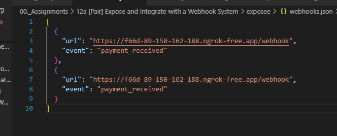
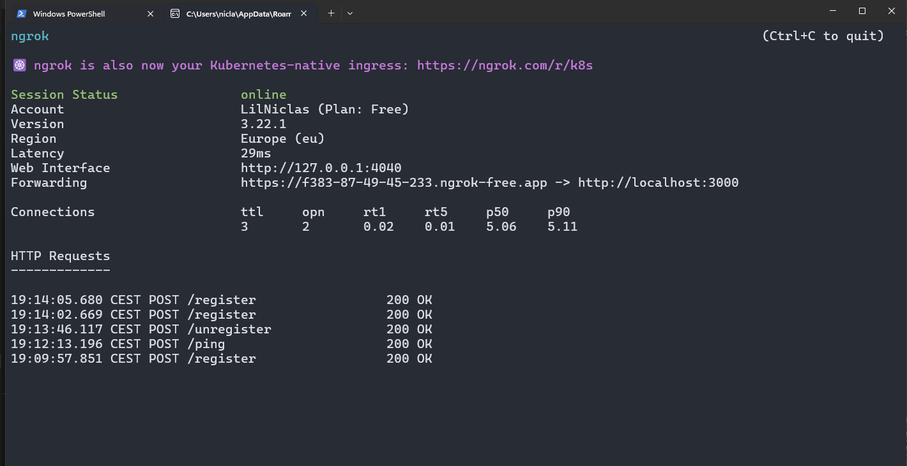

# Exposee Procedure for Running the Webhook System

## Start the Exposee Server

First, navigate to the **exposee** directory and start the server:

```bash
cd exposee
node server.js
```

## Expose the Server with Ngrok
Next, you need to expose your local server to the internet:

```bash
ngrok http 3000
```

A new terminal should open up with the new ngrok instance

## Copy the Ngrok URL
Copy the https URL, like and send to integrator:
https://f3a7-87-49-45-233.ngrok-free.app
Send this URL to the Integrator, so they can register their webhook.

## Checking Webhooks
You can check the registered webhooks in the webhooks.json file inside the exposee directory:
exposee/webhooks.json



## Ping the Integrator
To test the connection, you can ping the integrator by executing the following command in bash:
```bash
curl -X POST https://f3a7-87-49-45-233.ngrok-free.app/ping
```
You should get:
{"message":"Ping sent to all registered webhooks."}


## Monitor Incoming Requests

In your ngrok terminal, you can track all HTTP requests being sent to your server. This includes:

- Webhook registrations
- Webhook unregistrations
- Ping requests




__Yderligere billeder kan findes i exposee/images__