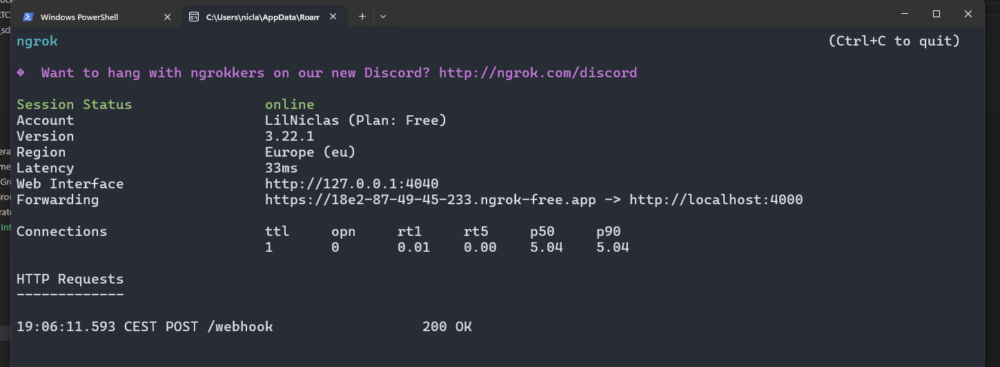

# Integrator Procedure for Running the Webhook System

## Start Integrator server

First, navigate to the **integrator** directory and start the server:

```bash
cd integrator
node server.js
```

## Expose the Server with Ngrok
Next, you need to expose your local server to the internet:

```bash
ngrok http 4000
```
Copy the https URL, like:
https://xyz123.ngrok-free.app


## Receive exposee URL
Receive the  https URL, like:
https://f3a7-87-49-45-233.ngrok-free.app


## Register Your Webhook with Exposee
Register your integrator server with your friend’s exposee:

```bash
curl -X POST https://f3a7-87-49-45-233.ngrok-free.app/register \
-H "Content-Type: application/json" \
-d '{"url": "https://xyz123.ngrok-free.app/webhook", "event": "payment_received"}'
```

You should receive:
{"message":"Webhook registered successfully."}

## Test the Ping
Ask your friend to trigger a ping. When the ping has been triggered you should receive something like this:
Received webhook event: { event: 'ping', message: 'Webhook test successful' } 
In your ngrok terminal you should also this


The exposee will received this in their terminal when a new webhook has been registered


## Unregister Your Webhook
When you’re done, you can unregister your webhook:

```bash
curl -X POST https://f3a7-87-49-45-233.ngrok-free.app/unregister \
-H "Content-Type: application/json" \
-d '{"url": "https://xyz123.ngrok-free.app/webhook", "event": "payment_received"}'
```